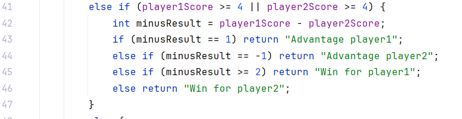
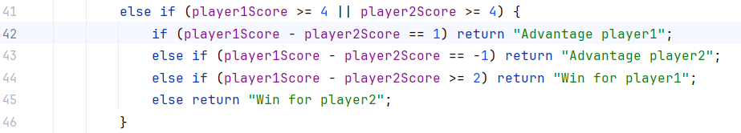
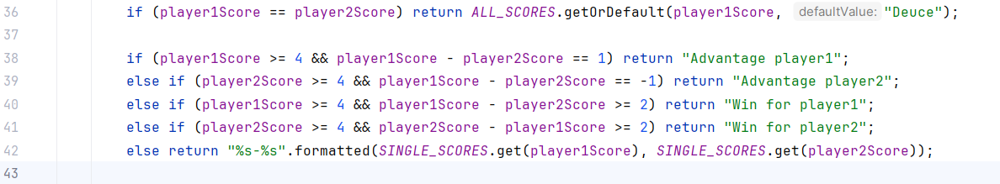
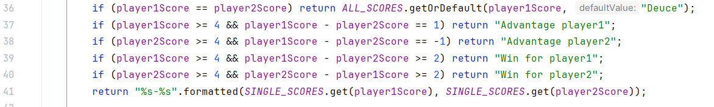
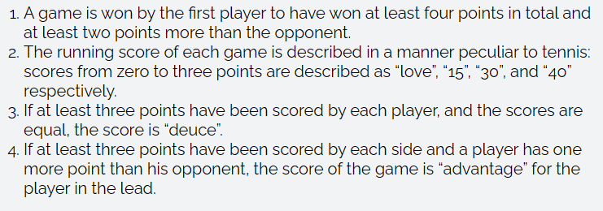
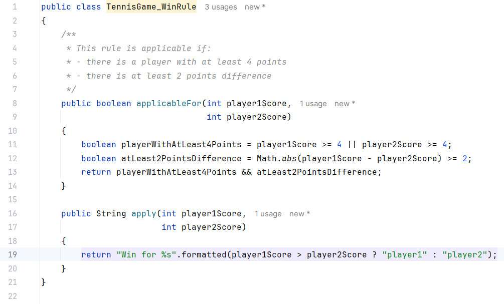
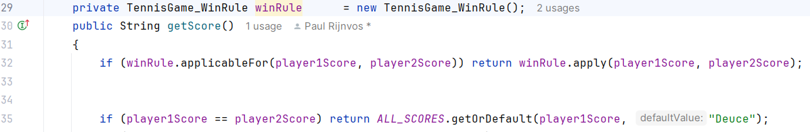

# TennisGame Refactoring Kata in Java

This is my implementation of the [TennisGame Coding Dojo aka Kata](https://codingdojo.org/kata/Tennis/).

The first time I heard about Kata's was while watching Youtube video's about software refactoring. Kevlin Henney is one of those speakers that are easy and pleasant to follow. But more important, he confirms most of my ideas/principles. Something I do not often or easy encounter with my direct collegeas. 

In one of the Youtube video's the refactoring of [The Gilded Rose](https://github.com/NotMyself/GildedRose) was mentioned and that triggered my curiosity.
As a software developer since 1985 I've seen software that covers quit a range of 'quality' as it comes to:
1. functionality. A lot of software can do a lot more than originally specified and actually does so...
2. readability
3. maintainability 

The first item can be tackled by implementing a proper set of tests. One that covers all functionality, ideally.
2 and 3 are mostly a matter of taste or oppinion..
For me I try do address these by attempting to the given specifications or rules 'echo' when reading the source-code out loud.
Most of the time this results in a separation between business specs/rules and coding algorithms. 

# The Scenario

Imagine you work for a consultancy company, and one of your colleagues has been doing some work for the Tennis Society. The contract is for 10 hours billable work, and your colleague has spent 8.5 hours working on it. Unfortunately he has now fallen ill. He says he has completed the work, and the tests all pass. Your boss has asked you to take over from him. She wants you to spend an hour or so on the code so she can bill the client for the full 10 hours. She instructs you to tidy up the code a little and perhaps make some notes so you can give your colleague some feedback on his chosen design. You should also prepare to talk to your boss about the value of this refactoring work, over and above the extra billable hours.

There are several versions of this refactoring kata, each with their own design smells and challenges. I suggest you start with the first one, with the class "TennisGame1". The test suite provided is fairly comprehensive, and fast to run. You should not need to change the tests, only run them often as you refactor.

There is a deliberate error in several of the implementations - the player names are hard-coded to "player1" and "player2". After you refactor, you may want to fix this problem and add suitable test cases to prove your fix works.

## The Refactoring...

Here I will describe my observations and actions step by step, recorded per commit.
Each refactoring of a TennisGame will be done in a separate branch to prevent refactorings interfer with eachother.

### Stage1
1. Clone the repo [TennisGame-Kata-Java](https://github.com/PaulRijnvos/TennisGame-Kata-Java.git) ideally from within your favourite IDE. The repo contains a Maven project. Most IDE's know how to handle these.
2. Perform a Maven verify. This should run flawless.
3. Familiarize yourself with the game and test at hand: TennisGame1 & TennisTest.checkAllScoresTennisGame1.
   * TennisTest.checkAllScoresTennisGame1 is rather straid forward. It runs a TennisGame1 for each given scoring-scenario and checks the resulting score with the expected score.
   * TennisGame1 is of more interest...

**Observation:**
TennisGame1 is given 2 playerNames via its constructor. These are in private variables, mostly for later use. 
But IntelliJ tells that each playerName is only used in the constructor.

=> We can get rid of the playerNames in TennisGame1. We comment them out and run the test and after succesful completion we remove the comments.

### Stage2
**Observation:**
Can we remove the constructor? It accepts 2 playernames but doesn't use them...
We comment them out: we get 1 error and that is at the instantiation of TennisGame1 in the test for this class.
=> We should be able to remove the playerNames from the instantiation in the test. We do so by commenting them out:

Verify by running the test.

=> Now we can also get rid of the redundant default constructor in TennisGame1.

Verify by running the test.

=> Remove the commented code.

### Stage3
Examine the code and probable functionality:
The TennisTest.checkAllScoresTennisGame1 creates for each given scenario a new TennisGame1. As in real life each game starts with a score of 0-0. Given a scenario the test simulates a game by simulating players scoring points up to the score given by the scenario.
The test concludes with verifying the TennisGame1.score() with the expected score from the scenario.

The test accesses the TennisGame1 via 2 methods:
1. wonPoint(String playerName) - This alters the respective score of the given player.
2. getScore() - This is the piece of proza we need to decipher.

**Observation:**
The player score are registered in the variables 'm_score1' and 'm_score2'.
=> Rename these to 'player1Score' and 'player2Score' respectively.

### Stage4
**Observation:**

The getScore() method contains 2 switch statements. Being functional clear when proper used, and in this case they are, switch statements do take a lot of room what makes them bloaty. Both switch statement take a score and return the equivalent score-string. We can achieve the same via a briefer and clearer method by storing these as key/value pairs in a map.

First we declare, initialize and populate the static 'ALL_SCORES' table.

And then we replace the switch-statement with the table-lookup:

We can repeat this for the other switch statement that gives a single score item given a score of (0, 1, 2 or 3).

First we declare, initialize and populate the static 'SINGLE_SCORES' table.

And then we replace the switch-statement with the table-lookup:

Verify by running test, green.

To be fair it was red at first because I returned the lookup immediately insteadof
concatenating it with the score.
This because the loop is used to build a running score with 2 single scores.

### Stage5
**Observation:**
As mentioned in the previous stage the original getScore() method uses a loop with 2 iterations to build up a string with the following format:
'&player1Score - &player2Score'. Even with the table lookup we don't need the 8 lines of code to achieve that. We can do it with 1 line:

=> We can also disregard the 'tempScore' variable, because it's never used anymore.

### Stage6
**Observation:**
There is no need for the getScore() method to use a score variable. Whenever the method encounters a conclusive situation it can immediately return the appropriate scoreString.
=> Remove the score variable and replace assignments to it with a return statement.

Verify by running test, green.

### Stage7
**Observation:**
We can now address the "WinOrAdvantage" block of the getScore() method.
It is almost only a scoreRestult per condition.
Therefor we need to get rid of the minusResult variable.

Here we go:

### Stage8
**Observation:**  
The advantage and win conditions for both players is mixed in 1 block.
Advantage and win for a player is only applicable if that player has at least 4 points and he has a higher score than the other.
We can also get rid of curly braces at simple if-statements. I know it is a matter of taste and not everybody likes this. But especially in this case it is helpfull.

And now we can make it 1 set of if statements.

### Stage9
Most programmers would be happy with this version of the code. It looks pretty clean and is good maintainable. 
But for me it still has a step to take from the given scoring rules to this code.
These are the scoring rules given by the kata:

Rule1 specifies only 1 rule to determine the winner.
We still need 2 if-statements for that and the wording of the rule needs "translation" to "coding".
Wouldn't it be clearer if we introduce a "WinRule" that we can ask if it is applicable and if so apply that rule?
This is the TennisGame_WinRule:

Officially we need testers for this new class. Except we have a fully covering test that shouldn't fail. So as long as this test doesn't run into problems I dare to postpone these tests.
... and it is still green..

And this is the application:

